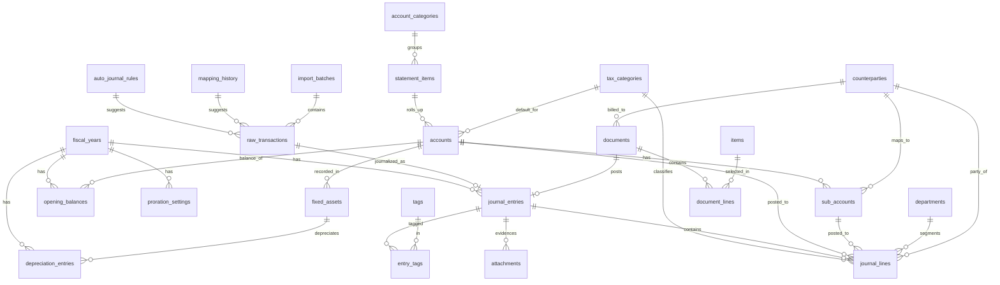

# データモデル設計書 — Kanean（v2）

> [PRD.md](./PRD.md) の §5.1 データアーキテクチャを具体化する。
> **control plane（共通1DB）** と **data plane（帳簿ごとDB）** の2層で定義する。
> 対象: 個人事業主・青色申告・簡易課税・固定資産・家事按分。参照サービス（商用クラウド会計サービス）の各画面/CSVを仕様の参考とする。
>
> **v2 変更点**: 参照サービスの固定資産・家事按分・請求書・取引先・品目・決算書(貸借)・仕訳帳/総勘定元帳CSVを反映。
> 部門/取引先/インボイス/証憑/タグを明細レベルに追加。自動仕訳ルールの方針を明確化。

---

## 0. 設計方針

| # | 方針 |
|---|---|
| D-1 | 金額は **INTEGER（円・小数なし）** で保持。税計算の端数処理は事業者設定に従い計算時に適用 |
| D-2 | 日付は **TEXT（ISO8601 `YYYY-MM-DD`）**。日時は `YYYY-MM-DDTHH:MM:SSZ` |
| D-3 | 真偽値は **INTEGER（0/1）**。区分値は **TEXT enum**（値はコメントで列挙） |
| D-4 | 比率（事業利用比率等）は **REAL**（0.01〜100、小数あり） |
| D-5 | 主キーは原則 `INTEGER PRIMARY KEY`。control plane の books.id のみ不透明ID（ULID/TEXT） |
| D-6 | 勘定科目体系・各種マスタは **ユーザーDB内に保持**。標準データはテンプレートからシード（`is_system`で区別） |
| D-7 | 年度をまたぐデータは `fiscal_year_id` で区切る |
| D-8 | 物理削除より **論理削除（`is_active`/`deleted_at`）** を基本（青色申告の帳簿訂正履歴要件） |
| D-9 | 主要テーブルへ `created_at` / `updated_at` を付与 |
| D-10 | `journal_entries` に存在する仕訳は **draft または confirmed**。元帳・試算表・決算は `confirmed` のみ集計する（[案B] 取込提案は draft で生成し、確認画面で明細編集して登録＝confirmed化） |

---

## 1. Control Plane（`control.sqlite`）

帳簿を跨いで参照が必要なものだけ。会計データは置かない。
認証・課金は持たない（[architecture.md] §5。ローカル単一ユーザー・127.0.0.1 限定バインド）。

### 1.1 `books`
| 列 | 型 | 説明 |
|---|---|---|
| id | TEXT PK | ULID。data plane ファイル名 `books/{id}.sqlite` に対応 |
| name | TEXT NOT NULL | 表示名（初回自動作成は「マイ帳簿」）。事業者名は data plane の `business_settings` が正 |
| created_at / updated_at | TEXT | |
| archived_at | TEXT NULL | アーカイブ日時（ISO8601）。NULL=アクティブ |

1インスタンスで**複数の帳簿**を持てる（税理士が顧問先を N 冊持つ想定）。
起動時にアクティブが0冊なら1冊自動作成する。**削除 API は提供しない**（不可逆で消えるのは税務データ）。

**アーカイブ**（`archived_at`）は削除の代替ではなく「一覧から下げる」だけ。control plane の状態変更のみで
data plane のファイル・証憑は残り、いつでも復帰できる。顧問契約の終了にも使う。
アーカイブ済みは**選択候補ではない**＝一覧の既定・暗黙解決・400 の候補から外れ、明示指定でのみ到達できて
参照は可・更新は 409（[architecture.md] §5）。最後のアクティブ帳簿はアーカイブできない
（アクティブ0冊は起動時の自動作成を誘発し、空の帳簿が生えるため）。

> `archived_at` は「アーカイブされた事実」だけを表す。将来の帳簿受け渡し（貸出中・預かり中）は
> これと直交する状態なので、単一の `status` 列に畳まず別に持つ（[roadmap.md] Phase 6）。

### 1.2 `backup_status`
| 列 | 型 | 説明 |
|---|---|---|
| id | INTEGER PK | |
| book_id | TEXT FK→books.id | |
| last_backup_at | TEXT | |
| last_status | TEXT | success / failed |
| destination | TEXT | バックアップ先（現状はローカルスナップショットの絶対パス） |
| detail | TEXT | |

### 1.3 `app_settings`
| 列 | 型 | 説明 |
|---|---|---|
| key | TEXT PK | 設定キー |
| value | TEXT NOT NULL | 値（文字列。妥当性はサーバが検証し、未知・壊れた値は「未設定」として扱う） |
| updated_at | TEXT NOT NULL | |

帳簿を跨ぐアプリ全体の設定。現状は `app_mode`（`personal`＝じぶんの帳簿 / `office`＝事務所）のみ。
帳簿ファイルは可搬（エクスポート・受け渡し）なので、アプリの都合は data plane に持ち込まない。
モードは起動導線と UI の露出範囲だけを決め、帳簿解決の規約は変えない（[architecture.md] §5）。

> 旧 `users` / `identities` / `sessions` / `subscriptions` は廃止済み
> （GitHub OAuth・セッション・課金の撤回に伴い DROP）。

## 2. Data Plane（`books/{book_id}.sqlite`）

### 2.1 `business_settings`（1行）
| 列 | 型 | 説明 |
|---|---|---|
| id | INTEGER PK | 常に1 |
| business_name | TEXT | 事業者名 |
| owner_name | TEXT | 氏名 |
| phone | TEXT | 電話番号 |
| entity_type | TEXT | `individual` 固定 |
| filing_type | TEXT | `blue`/`white`（既定 blue） |
| filing_form | TEXT | `general`/`real_estate` |
| industry | TEXT | 業種区分（後述 enum） |
| prefecture | TEXT | 都道府県 |
| ebook_storage | INTEGER | 電子帳簿保存 0/1 |
| tax_method | TEXT | `simplified` 固定（簡易課税） |
| tax_business_category | TEXT | 簡易課税 事業区分（第1〜6種） |
| accounting_method | TEXT | `tax_included`(税込)/`tax_excluded`(税抜) |
| rounding_sales | TEXT | 売上端数 `floor`/`round`/`ceil` |
| rounding_purchase | TEXT | 仕入端数 同上 |
| depreciation_record_method | TEXT | `direct`(直接法)/`indirect`(間接法) |
| created_at / updated_at | TEXT | |

**業種区分 enum**: 製造業/教育/医療福祉/情報通信/飲食業/運送業/卸売業/小売業/金融保険業/不動産業/サービス業/その他
**簡易課税 事業区分 enum**: 第1種(卸売)/第2種(小売)/第3種(製造)/第4種(その他)/第5種(サービス)/第6種(不動産)

### 2.2 `fiscal_years`
| 列 | 型 | 説明 |
|---|---|---|
| id | INTEGER PK | |
| start_date / end_date | TEXT | 期首/期末 |
| status | TEXT | open / closed |
| created_at | TEXT | |

> **初回年度の確定**: 最初の会計年度は**利用開始時にユーザーが対象年度を明示選択**して作成する（暦年 1/1〜12/31・`status='open'`、`POST /api/fiscal-years`）。CSVの先頭行から年度を推測する旧仕様は廃止（壊れたCSVで年度が誤確定し、以後の取込が C-8 ゲートで弾かれ続ける事故を防ぐ）。
> 既定値は申告実務に合わせ **1〜4月は前年・それ以外は当年**（確定申告は前年分を翌年2〜3月に提出するため。`GET /api/fiscal-years/suggested`）。年度未設定では取込・帳票は実行できない。翌年度は本テーブルへ直接追加せず**年度繰越**で作る。誤った年度をやり直す場合はユーザーデータを初期化する。

---

### 2.3 勘定科目体系（5階層）

```
report_type（帳票: BS/PL）
  └ account_categories（分類）  ← section（流動資産 等）を保持
       └ statement_items（決算書科目）  ← 決算書/申告書の行
            └ accounts（勘定科目）
                 └ sub_accounts（補助科目）
```
> 1決算書科目に複数勘定科目がぶら下がる例あり（棚卸資産→商品/材料…、福利厚生費→福利厚生費/法定福利費）。

#### 2.3.1 `account_categories`（分類）
| 列 | 型 | 説明 |
|---|---|---|
| id | INTEGER PK | |
| report_type | TEXT | `BS`/`PL` |
| section | TEXT | **決算書のセクション**。BS: 流動資産/固定資産/繰延資産/流動負債/固定負債/資本 ／ PL: 売上/売上原価/経費/その他 |
| name | TEXT | 現金及び預金 / 経費 等 |
| sort_order | INTEGER | |

#### 2.3.2 `statement_items`（決算書科目）
| 列 | 型 | 説明 |
|---|---|---|
| id | INTEGER PK | |
| category_id | INTEGER FK→account_categories | |
| name | TEXT | 普通預金 / 水道光熱費 等 |
| statement_line_code | TEXT | 決算書/申告書の該当行コード（帳票マッピング仕様で定義） |
| sort_order | INTEGER | |

#### 2.3.3 `accounts`（勘定科目）
| 列 | 型 | 説明 |
|---|---|---|
| id | INTEGER PK | |
| statement_item_id | INTEGER FK→statement_items | |
| name | TEXT | |
| default_tax_category_id | INTEGER FK→tax_categories | 既定税区分 |
| search_key | TEXT | 検索キー |
| normal_balance | TEXT | `debit`/`credit` |
| is_active | INTEGER | 使用 0/1 |
| is_system | INTEGER | 標準科目 1 / ユーザー追加 0 |
| sort_order | INTEGER | |
| created_at / updated_at | TEXT | |

#### 2.3.4 `sub_accounts`（補助科目）
| 列 | 型 | 説明 |
|---|---|---|
| id | INTEGER PK | |
| account_id | INTEGER FK→accounts | |
| name | TEXT | 例「三菱東京UFJ銀行…普通3903744」「トイウェア株式会社」 |
| default_tax_category_id | INTEGER FK→tax_categories | 任意 |
| counterparty_id | INTEGER FK→counterparties | 任意（取引先補助科目）。同一(account_id, counterparty_id)は1件のみ（get-or-create で一意化） |
| linked_account_ref | TEXT | 取込元口座/カードの識別子 |
| is_active | INTEGER | |
| sort_order | INTEGER | |
| created_at / updated_at | TEXT | 「補助科目なし」はNULLで表現 |

> 取引先補助科目（売掛/買掛の取引先別繰越）は、請求書起票（§2.13）と開始残高グリッドの「取引先別の繰越を追加」の両経路で `getOrCreateCounterpartySubAccount` を通じ作成され、同一(勘定, 取引先)に**収束**する（`createSubAccount` も同一取引先の二重作成を拒否）。開始残高で先に作っても、後の請求書起票は同じ補助科目へ計上される。

#### 2.3.5 `tax_categories`（税区分マスタ）
| 列 | 型 | 説明 |
|---|---|---|
| id | INTEGER PK | |
| code | TEXT | 一意コード（例 `SALE_10_C5`, `PUR_8`, `OUT`） |
| label | TEXT | 原表記（例「課売 8% 五種」） |
| taxability | TEXT | `taxable`/`non_taxable`/`out_of_scope` |
| direction | TEXT | `sale`/`purchase`/`none` |
| rate | INTEGER | 税率%（10/8/0、NULL=対象外） |
| simplified_category | TEXT | 簡易課税 事業区分（売上系のみ） |
| adjustment | TEXT | `none`/`return`(返還)/`bad_debt`(貸倒) |
| is_active | INTEGER | |

---

### 2.4 `departments`（部門マスタ）
仕訳帳CSVの「借方部門/貸方部門」に対応。個人事業主では通常未使用だが、明細レベルの区分として保持。

| 列 | 型 | 説明 |
|---|---|---|
| id | INTEGER PK | |
| name | TEXT | 部門名 |
| is_active | INTEGER | |
| sort_order | INTEGER | |

### 2.5 `counterparties`（取引先マスタ）
| 列 | 型 | 説明 |
|---|---|---|
| id | INTEGER PK | |
| name | TEXT | 取引先名 |
| name_kana | TEXT | カナ |
| honorific | TEXT | 敬称（御中/様…） |
| customer_code | TEXT | 顧客コード |
| invoice_reg_no | TEXT | 適格請求書発行事業者 登録番号 |
| peppol_id | TEXT | Peppol ID（電子インボイス） |
| payment_term_month | TEXT | 支払期限・月（当月/翌月…） |
| payment_term_day | TEXT | 支払期限・日（末日/15日…） |
| holiday_adjustment | TEXT | 土日祝調整（変更しない/前営業日/翌営業日） |
| zip / prefecture / address1 / address2 | TEXT | 連絡先住所 |
| phone / email / cc_email | TEXT | 連絡先 |
| contact_name / contact_title | TEXT | 担当者（MVPは1件内包。複数=将来 `counterparty_departments`） |
| memo | TEXT | |
| is_active | INTEGER | |
| created_at / updated_at | TEXT | |

> 参照サービスの「部門」タブ（取引先内の複数連絡先）は個人用途では過剰。MVPは連絡先1件を内包し、複数化は将来 `counterparty_departments` を追加。
> 「繰越残高額」は取引先別の売掛/買掛繰越 → `opening_balances`（補助科目=取引先）で表現。

### 2.6 `items`（品目マスタ）
請求書明細から参照（直接入力も可）。

| 列 | 型 | 説明 |
|---|---|---|
| id | INTEGER PK | |
| name | TEXT | 品目（品名/品番） |
| item_code | TEXT | 品目コード |
| unit_price | INTEGER | 単価 |
| default_quantity | INTEGER | 既定数量 |
| unit | TEXT | 単位 |
| detail | TEXT | 品目詳細 |
| tax_rate | INTEGER | 消費税率%（10/8） |
| withholding | INTEGER | 源泉徴収する 0/1 |
| is_active | INTEGER | |

---

### 2.7 開始残高 `opening_balances`
| 列 | 型 | 説明 |
|---|---|---|
| id | INTEGER PK | |
| fiscal_year_id | INTEGER FK→fiscal_years | |
| account_id | INTEGER FK→accounts | |
| sub_account_id | INTEGER FK→sub_accounts | NULL可 |
| side | TEXT | `debit`/`credit` |
| amount | INTEGER | |

> 元入金もこの表で表現。貸借合計一致を整合性チェックで担保。

---

### 2.8 仕訳

#### 2.8.1 `journal_entries`（ヘッダ）
| 列 | 型 | 説明 |
|---|---|---|
| id | INTEGER PK | CSVの「取引No」に対応 |
| fiscal_year_id | INTEGER FK→fiscal_years | |
| entry_date | TEXT | 取引日 |
| slip_no | TEXT | 伝票番号（任意） |
| description | TEXT | 摘要 |
| memo | TEXT | メモ（摘要とは別。200字） |
| source | TEXT | manual / import / auto_rule / depreciation / proration / invoice / opening |
| source_ref | TEXT | 生成元参照（raw_transactions.id, fixed_asset.id, document.id 等） |
| status | TEXT | `confirmed`/`draft`（[案B] D-10参照） |
| created_at / updated_at | TEXT | |

#### 2.8.2 `journal_lines`（明細）
| 列 | 型 | 説明 |
|---|---|---|
| id | INTEGER PK | |
| entry_id | INTEGER FK→journal_entries | |
| line_no | INTEGER | |
| side | TEXT | `debit`(借方)/`credit`(貸方) |
| account_id | INTEGER FK→accounts | |
| sub_account_id | INTEGER FK→sub_accounts | NULL可 |
| department_id | INTEGER FK→departments | NULL可（CSVの部門列） |
| counterparty_id | INTEGER FK→counterparties | NULL可（明細直付け。CSVの取引先列） |
| amount | INTEGER | 金額（税込/税抜は経理方式に従う） |
| tax_category_id | INTEGER FK→tax_categories | 明細ごとの税区分 |
| tax_amount | INTEGER | 消費税額（算出値） |
| is_qualified_invoice | INTEGER | 適格（インボイス）0/1。CSVのインボイス列 |
| proration_applied | INTEGER | 家事按分適用済み 0/1 |
| description | TEXT | 明細摘要（任意） |

> 整合性: entry内で Σ借方 = Σ貸方。総勘定元帳の「相手勘定科目・残高」は明細からの**導出ビュー**（テーブル化しない）。

#### 2.8.3 `attachments`（証憑・添付ファイル）
電子帳簿保存法（business_settings.ebook_storage）対応。**Phase5 slice8 で `journal_entry` への添付を配線済**
（storage 層 + upload/DL/delete API + 仕訳帳の添付UI）。`document` への添付は未配線（スコープ外）。

| 列 | 型 | 説明 |
|---|---|---|
| id | INTEGER PK | |
| target_type | TEXT | `journal_entry`/`document`（現状は `journal_entry` のみ書込み） |
| target_id | INTEGER | 対象ID（index `attachments_target_idx` on (target_type,target_id)） |
| file_name | TEXT | 表示名（クライアント申告。DL 時に RFC5987 エンコード） |
| storage_path | TEXT | `DATA_DIR/books/{bookId}/attachments/` 配下の**サーバ生成リーフ名**（クライアント名は使わない＝traversal 防止）。クライアントへは返さない |
| content_type | TEXT | MIME（PDF/JPEG/PNG/HEIC を受理） |
| sha256 | TEXT | SHA-256 hex（slice8 追加・電帳法 真実性確保の基盤＝改ざん検知用） |
| file_size | INTEGER | バイト数（slice8 追加） |
| uploaded_at | TEXT | アプリ層 ISO 文字列（**認定タイムスタンプ＝TSA ではない**） |

> ⚠️ 真実性確保の基盤（sha256・サイズ・検索インデックス）は用意するが、**電帳法の保存要件
> （検索要件・訂正削除履歴・タイムスタンプ認定・見読性）の充足判断は申告者/税理士の責任**であり、
> システムは「電帳法準拠」を宣言しない。保存時暗号化・鍵管理・TSA・OCR・添付の訂正削除履歴は
> スコープ外（人間/専門家ゲート。[architecture] A-3）。

#### 2.8.4 `tags` / `entry_tags`
| `tags` | 型 | |
|---|---|---|
| id | INTEGER PK | |
| name | TEXT | UNIQUE |

| `entry_tags` | 型 | |
|---|---|---|
| entry_id | INTEGER FK→journal_entries | |
| tag_id | INTEGER FK→tags | PK(entry_id, tag_id) |

> 請求書のタグも同 `tags` を参照（`document_tags` を将来追加）。

---

### 2.9 自動仕訳

> **参照サービスとの差異（重要）**: 参照サービスは全利用者データを学習したクラウドML/ルールで科目を推測しており、ユーザー定義ルール画面を持たない。
> 本システムはそのコーパスを持たないため、(1) **ユーザー定義ルール** と (2) **自分の履歴からの学習** を主軸にする。将来マルチユーザー化時に (3) 匿名集約の共有ルールを検討。

> **2トラック（重要）**: 自動仕訳には2系統あり、本節のルールエンジン（`auto_journal_rules`/institution）は **UIトラック（人が手動CSVをUIで取込）専用**。**スキルトラック（EC連携取込）の科目分類は外部スキルのAIが担い**（確定履歴 ▶ md ポリシー。[acquisition-skill-spec §7]）、`auto_journal_rules`/institution は関与しない。両者を繋ぐのが `mapping_history`（§2.9.2）＝UIでの確定実績を次回のAI提案へ優先反映する学習ループ。

#### 2.9.1 `auto_journal_rules`（ユーザー定義ルール）
> **UIトラック専用**: 手動CSV取込の科目推測に使う。EC連携（スキルトラック）の品目分類には適用しない（[acquisition-skill-spec §7.1]）。

| 列 | 型 | 説明 |
|---|---|---|
| id | INTEGER PK | |
| name | TEXT | |
| priority | INTEGER | 小さいほど先 |
| match_field | TEXT | description / amount / source |
| match_op | TEXT | contains / equals / regex / range |
| match_value | TEXT | 条件値（範囲はJSON） |
| direction | TEXT | in / out / any |
| result_account_id | INTEGER FK→accounts | |
| result_sub_account_id | INTEGER FK→sub_accounts | 任意 |
| result_tax_category_id | INTEGER FK→tax_categories | 任意 |
| is_active | INTEGER | |
| created_at / updated_at | TEXT | |

#### 2.9.2 `mapping_history`（履歴学習）
過去に確定した「摘要パターン→科目」を記録し、次回の取込でサジェスト。

| 列 | 型 | 説明 |
|---|---|---|
| id | INTEGER PK | |
| source_type | TEXT | 口座/カード種別 |
| pattern | TEXT | 正規化した摘要キー |
| account_id | INTEGER FK→accounts | |
| sub_account_id | INTEGER FK→sub_accounts | 任意 |
| tax_category_id | INTEGER FK→tax_categories | 任意 |
| hit_count | INTEGER | 採用回数（サジェスト順位） |
| last_used_at | TEXT | |

- **EC連携への転用（スキルトラック）**: `source_type=amazon/rakuten`・`pattern=正規化 item_name` で同テーブルを使う。**UIで draft を確定した時に「品目→科目」を書き戻す**フックを持ち、これがスキルのAI分類の最優先入力になる（学習ループ・[acquisition-skill-spec §7.2]）。
- **AIへの注入は絞る（payload を履歴総量から切り離す）**: スキルが叩く `GET 分類履歴` API は今回バッチの品名に**関連する行**だけ返す＝① 集約済みペア（`hit_count`）② 品名トークン一致のプレフィルタ ③ `last_used_at` 直近 **12か月以内** ④ `recency × hit_count` 上位K件（例 200）。**行は削除しない**（忘却＝注入ポリシーであり監査・再学習用に残す）。詳細 [acquisition-skill-spec §7.3]。
- **学習汚染の境界**: institution（源泉/消費税/利息）は決定的再導出のため学習しない（[csv-format §5]）。EC経費の品目分類はユーザー自身の明示判断・税影響限定のため学習してよい。

---

### 2.10 取込（CSV / EC）

#### 2.10.1 `import_batches`
| 列 | 型 | 説明 |
|---|---|---|
| id | INTEGER PK | |
| source_type | TEXT | bank_ufj / bank_shinsei / card_mufg_visa / amazon / rakuten |
| account_ref | TEXT | 口座識別子（sub_accounts.linked_account_ref と対応） |
| file_name | TEXT | |
| imported_at | TEXT | |
| row_count | INTEGER | |
| status | TEXT | done / partial / failed |

#### 2.10.2 `raw_transactions`
| 列 | 型 | 説明 |
|---|---|---|
| id | INTEGER PK | |
| batch_id | INTEGER FK→import_batches | |
| txn_date | TEXT | |
| amount | INTEGER | |
| direction | TEXT | in(入金)/out(出金) |
| description | TEXT | 正規化後摘要 |
| raw_payload | TEXT | 元CSV行(JSON)。監査用 |
| proposal_json | TEXT | 後付け分類（acquisition classify）の根拠（proposedAccount/reason/confidence/policyRef の JSON）。raw_payload は取込時の原本で UI CSV の配列 payload には相乗りできないため独立列に持つ（由来表示は 新列 → payload → entry.source の順で解決） |
| dedup_hash | TEXT | 重複検出キー |
| account_ref | TEXT | 口座/カード識別子（import_batches と同値を非正規化）。UNIQUE(account_ref, dedup_hash) |
| suggested_account_id | INTEGER FK→accounts | 推測科目。UIトラック=ルール/履歴、スキルトラック=AI仕訳候補（[csv-format §4.2] `proposed_account` を検証） |
| suggested_sub_account_id | INTEGER FK→sub_accounts | 任意 |
| suggested_tax_category_id | INTEGER FK→tax_categories | 任意 |
| status | TEXT | pending / journalized / ignored |
| journal_entry_id | INTEGER FK→journal_entries | 確定後リンク |

> [案B] 取込時に draft の journal_entries を生成する運用も可。その場合 suggested_* はdraft明細に展開し、本テーブルは原データ保持に専念。実装時に確定。
> **スキルトラック（EC）**: `suggested_*` は外部スキルのAI仕訳候補（[csv-format §4.2] `proposed_account`/`treatment`）由来。本体は `account_id` へ検証し未知/曖昧は未確定勘定＋flag。`auto_journal_rules`/institution は適用しない（[acquisition-skill-spec §7.1]）。借方＝AI科目、貸方＝未払金（[csv-format §4.3]）。
> **会計期間ゲート**: 本テーブルには**開いている会計期間（`fiscal_years.status='open'`）の取引のみ**を登録する。翌期分は登録しない（保留テーブルは設けない）。年度繰越で翌期が open になってから取り込む（[csv-format C-8] / [acquisition-skill-spec §5]）。`txn_date` で判定。
> **仕訳化にも同じゲートが効く**: 取込時だけでなく、**draft 仕訳を作る時点でも** `txn_date` が open 年度の範囲内であることを要求する（`journal/fiscalPeriod`）。本テーブルは物理削除も年度移動もしないため、繰越を跨ぐと過年度の `pending`/`ignored` 行が残る。これを仕訳化すると `fiscal_year_id` は当期・`entry_date` は過年度という食い違った仕訳ができ、試算表には載るが推移表からは落ちる。単発（復帰）は拒否、バッチは件数を返してスキップする。
> **年スコープ**: `fiscal_year_id` 列は持たない。一覧（`GET /api/raw-transactions`）は既定で open 年度の `[start_date, end_date]` に閉じ、`?years=all` で解除する。スコープ外の件数は `outOfYearTotal` で返す（黙って隠さない）。**行は残す。一覧から外すだけ**（`raw_payload` の原文・`journal_entry_id` の逆引き・`settlement_raw_id` の名寄せリンクは証跡として要る）。

---

### 2.11 固定資産

#### 2.11.1 `fixed_assets`
| 列 | 型 | 説明 |
|---|---|---|
| id | INTEGER PK | |
| management_no | TEXT | 管理番号 |
| name | TEXT | 資産の名前 |
| reflect_name_to_description | INTEGER | 仕訳摘要に反映 0/1 |
| account_id | INTEGER FK→accounts | 計上科目（車両運搬具等） |
| acquisition_cost | INTEGER | 取得価額 |
| quantity_or_area | REAL | 数量または面積（既定1） |
| acquired_date | TEXT | 取得日 |
| business_start_date | TEXT | **事業供用開始日**（取得日と別。償却開始判定） |
| depreciation_method | TEXT | straight_line(定額)/declining_balance(定率)/lump_sum(一括償却)/minor_special(少額特例)/old_straight/old_declining |
| useful_life | INTEGER | 耐用年数 |
| depreciation_rate | REAL | 償却率（耐用年数表より） |
| business_use_ratio | REAL | 事業利用比率 0.01–100% |
| real_estate_ratio | REAL | 事業利用のうち不動産割合 0–100% |
| opening_book_value | INTEGER | 期首残高（空=取得価額） |
| special_depreciation_amount | INTEGER | 特別償却額 |
| retired_date | TEXT | 消失日（除却/売却） |
| include_in_blue_return | INTEGER | 青色申告決算書への計上 0/1 |
| note | TEXT | 摘要 |
| status | TEXT | active / retired |
| created_at / updated_at | TEXT | |

> 少額特例・一括償却は独立フラグでなく `depreciation_method` の選択肢として表現（v1の `special_treatment` を統合）。

#### 2.11.2 `depreciation_entries`（年度別）
| 列 | 型 | 説明 |
|---|---|---|
| id | INTEGER PK | |
| fixed_asset_id | INTEGER FK→fixed_assets | |
| fiscal_year_id | INTEGER FK→fiscal_years | |
| opening_book_value | INTEGER | 今期償却前残高 |
| depreciation_amount | INTEGER | 今期償却(予定)額 |
| business_amount | INTEGER | 経費算入額（事業利用比率適用後） |
| closing_book_value | INTEGER | 今期償却後残高 |
| journal_entry_id | INTEGER FK→journal_entries | 期末に生成した償却仕訳 |

> 記帳方法（直接/間接）で貸方科目（資産直接 or 減価償却累計額）を切替。一覧の各列に対応。

---

### 2.12 家事按分 `proration_settings`
> **位置づけ**: 按分は申告項目ではなく**仕訳生成設定**。期末に `事業主貸 / 経費科目` の按分仕訳（source='proration'）を生成し、通常の経費減として損益に反映。決算書への専用マッピングは不要。

| 列 | 型 | 説明 |
|---|---|---|
| id | INTEGER PK | |
| fiscal_year_id | INTEGER FK→fiscal_years | 年度ごとに比率可変 |
| account_id | INTEGER FK→accounts | 対象科目（水道光熱費/車両費 等） |
| sub_account_id | INTEGER FK→sub_accounts | NULL=その科目の全補助科目（画面の「全て」） |
| business_ratio | REAL | 事業利用比率%（50.0等） |
| method | TEXT | year_end(期末一括)/each(都度) |
| note | TEXT | 按分根拠 |

> 一覧の「経費対象/対象外の金額」は仕訳登録済経費×比率からの算出値。

---

### 2.13 請求書系（Phase 5 slice9 で invoice を配線）

> **slice9 実装済**: `documents`/`document_lines` CRUD（合計＝小計/消費税/源泉/総額はサーバ再計算）。`invoice` の起票で**売掛金の複合仕訳**を生成（税込経理: 借)売掛金[総額]/貸)売上高[税率別・税区分]、源泉あり: 借)売掛金[総額−源泉] 借)事業主貸(源泉所得税)[源泉]/貸)売上高[総額]）、`journal_entries.source='invoice'`・confirmed、`documents.journal_entry_id` を back-link。入金消込（借)現金預金/貸)売掛金）、領収書は invoice の複製（仕訳は元を参照・新規起票なし）。status: draft→issued→collected / void（起票前のみ）。**売掛金は取引先別の補助科目で内訳管理**: 起票時に `sub_accounts.counterparty_id` で取引先と1:1の売掛金補助科目を遅延作成（取引先名で命名・無ければ作成）し、起票/消込の売掛金行へ `sub_account_id` を付与（取引先未指定の請求は親科目へ直課）。これにより補助元帳・開始残高に顧客別売掛が出る。標準シードには売掛金/取引先の補助科目は持たない。**売上計上時期・源泉・消費税区分は税理士サインオフ対象**。PDF・見積/納品ライフサイクル・部分入金・返還/貸倒・非課税売上はスコープ外。

#### 2.13.1 `documents`（見積/納品/請求/領収）
| 列 | 型 | 説明 |
|---|---|---|
| id | INTEGER PK | |
| doc_type | TEXT | quote / delivery / invoice / receipt |
| doc_no | TEXT | 帳票番号（請求書番号等） |
| counterparty_id | INTEGER FK→counterparties | |
| honorific | TEXT | 敬称（御中等） |
| subject | TEXT | 件名 |
| issue_date | TEXT | 請求日/発行日 |
| due_date | TEXT | 支払期限 |
| revenue_recognition_date | TEXT | **売上計上日**（請求日と別。売上仕訳の日付） |
| payment_info | TEXT | 振込先 |
| remarks | TEXT | 備考 |
| memo | TEXT | 管理用メモ |
| subtotal | INTEGER | 税抜小計 |
| tax_total | INTEGER | 消費税合計 |
| withholding_total | INTEGER | 源泉徴収税額合計 |
| total | INTEGER | 合計 |
| status | TEXT | draft / issued / paid 等 |
| converted_from_id | INTEGER FK→documents | 見積→請求等の変換元 |
| journal_entry_id | INTEGER FK→journal_entries | 売掛金仕訳 |
| created_at / updated_at | TEXT | |

#### 2.13.2 `document_lines`
| 列 | 型 | 説明 |
|---|---|---|
| id | INTEGER PK | |
| document_id | INTEGER FK→documents | |
| line_no | INTEGER | |
| item_id | INTEGER FK→items | 任意（直接入力可） |
| description | TEXT | 品目 |
| delivery_date | TEXT | 納品日 |
| unit_price | INTEGER | 単価 |
| quantity | REAL | 数量 |
| amount | INTEGER | 金額 |
| tax_rate | INTEGER | 税率%（10/8） |
| withholding | INTEGER | 源泉徴収 0/1 |
| delivery_doc_no | TEXT | 納品書番号 |

---

## 3. ER図（data plane 主要部）



---

## 4. 主要な設計判断（メモ）

| # | 判断 | 理由 |
|---|---|---|
| M-1 | 決算書科目と勘定科目を別テーブル | 1決算書科目に複数勘定科目（棚卸資産/福利厚生費） |
| M-2 | 仕訳をヘッダ+明細（複合仕訳対応） | 源泉徴収・税抜経理・按分など1:1で表せない取引 |
| M-3 | 税区分をマスタ+構造化列 | 簡易課税の事業区分・税率・返還/貸倒を計算で扱う |
| M-4 | raw_transactions に原データ＋dedup_hash | 取込の冪等性・電子帳簿保存・監査 |
| M-5 | 取引先・部門・インボイスを明細レベルに | 仕訳帳/総勘定元帳CSVが明細単位で持つため |
| M-6 | account_categories に section | 決算書のセクション（流動資産等）グルーピング |
| M-7 | 自動仕訳はユーザールール＋履歴学習 | 参照サービスのクラウドMLコーパスを持たないため |
| M-8 | 家事按分は仕訳生成設定（申告項目でない） | 按分結果は事業主貸/経費の仕訳として損益に反映 |
| M-9 | 少額特例/一括償却は償却方法に統合 | 参照サービスの固定資産追加画面が償却方法で選択 |
| M-10 | 証憑 `attachments` を polymorphic | 仕訳・請求書の双方に添付（電子帳簿保存） |

---

## 5. 帳票・CSVマッピング（参照）

### 5.1 決算書(貸借対照表)の構造
- 資産の部 = section ∈ {流動資産, 固定資産, 繰延資産}、負債の部 = {流動負債, 固定負債}、資本の部 = {資本}
- 各 section 配下に decision書科目を集計、section合計・部合計を算出
- **控除前所得金額**（資本の部）= 損益計算書の当期所得を連結する算出行
- → `account_categories.section` + `statement_items.statement_line_code` で表現。詳細は別途「帳票マッピング仕様」

### 5.2 仕訳帳CSV ヘッダ（出力仕様）
```
取引No, 取引日, 借方勘定科目, 借方補助科目, 借方部門, 借方取引先, 借方税区分, 借方インボイス, 借方金額(円),
貸方勘定科目, 貸方補助科目, 貸方部門, 貸方取引先, 貸方税区分, 貸方インボイス, 貸方金額(円), 摘要, タグ, メモ
```
→ journal_entries + journal_lines から生成。複合仕訳は同一「取引No」で複数行。

### 5.3 総勘定元帳CSV ヘッダ（出力仕様）
```
取引No, 取引日, 勘定科目, 補助科目, 取引先, 税区分, インボイス,
相手勘定科目, 相手補助科目, 相手取引先, 相手税区分, 相手インボイス, 摘要, 借方金額, 貸方金額, 残高, メモ, タグ
```
→ journal_lines を科目別に並べ、相手科目・残高を算出する**導出ビュー**。

---

## 6. 未確定・次文書で詰める点

- [x] **会計仕様書**: tax_categories 全コード定義、みなし仕入率、端数処理、normal_balance 決定規則 → [accounting-spec.md](./accounting-spec.md)
- [x] **帳票マッピング仕様（PDF層）**: statement_line_code → 決算書/確定申告書/消費税申告書(簡易)の各欄 → [form-mapping.md](./form-mapping.md)
- [x] **減価償却計算仕様**: 償却率・月割・備忘1円・少額特例/一括償却・除却 → [depreciation-spec.md](./depreciation-spec.md)
- [x] **CSVフォーマット定義書**: 各 source_type の取込列 → raw_transactions → [csv-format.md](./csv-format.md)
- [ ] 標準シードデータ（勘定科目・税区分・耐用年数表）
- [ ] SQLite暗号化（SQLCipher等）の採否
- [ ] [案B]の実装詳細: 取込時に draft journal_entries を作るか、raw_transactions に留めるか
- [ ] **取込元をまたぐ決済リンク**: EC↔カード↔銀行の付替え（クリアリング勘定の相殺）を表す `raw_transactions` 間リンク or 対応テーブル（[csv-format §3.1](./csv-format.md)）。未払金はチャネル別補助科目＝クリアリング勘定として運用
